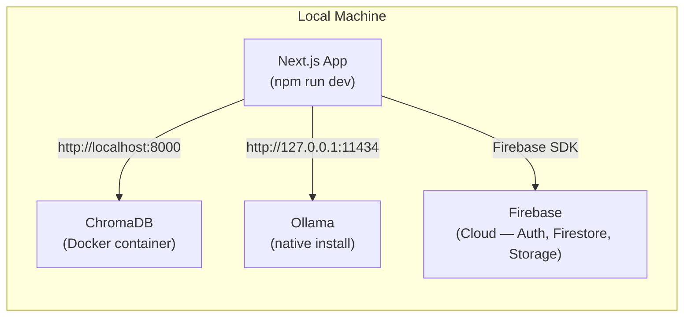

# Dockerizing ThinkStack — Full Analysis

## Current Architecture



| Component | How it runs today | Connection |
|---|---|---|
| **Next.js App** | `npm run dev` on bare metal | — |
| **ChromaDB** | Docker container (standalone) | `http://localhost:8000` via `CHROMA_URL` env var |
| **Ollama (LLM + Embeddings)** | Native install on host | Hardcoded `http://127.0.0.1:11434` in multiple files |
| **Firebase** | Cloud-hosted (Auth, Firestore, Storage) | Client SDK + `serviceAccountKey.json` |

---

## Services to Containerize

| # | Service | Image | Notes |
|---|---|---|---|
| 1 | **Next.js App** | Custom `Dockerfile` (multi-stage build) | The main app — all API routes, SSR, frontend |
| 2 | **ChromaDB** | `chromadb/chroma:latest` | Already in Docker, just needs to move into compose |
| 3 | **Ollama** | `ollama/ollama:latest` | GPU passthrough needed for good perf |
| 4 | *(Firebase stays cloud)* | — | No container needed; it's a managed SaaS |

---

## Required Changes

### 1. New Files to Create

#### `Dockerfile` (project root)

```dockerfile
# ---- Stage 1: Install dependencies ----
FROM node:20-alpine AS deps
WORKDIR /app
COPY package.json package-lock.json ./
RUN npm ci --omit=dev

# ---- Stage 2: Build the Next.js app ----
FROM node:20-alpine AS builder
WORKDIR /app
COPY --from=deps /app/node_modules ./node_modules
COPY . .
# Build args become env vars at build time
ARG NEXT_PUBLIC_FIREBASE_API_KEY
ARG NEXT_PUBLIC_FIREBASE_AUTH_DOMAIN
ARG NEXT_PUBLIC_FIREBASE_PROJECT_ID
ARG NEXT_PUBLIC_FIREBASE_STORAGE_BUCKET
ARG NEXT_PUBLIC_FIREBASE_APP_ID
ARG NEXT_PUBLIC_FIREBASE_MEASUREMENT_ID
ARG NEXT_PUBLIC_FIREBASE_DATABASE_URL
RUN npm run build

# ---- Stage 3: Production runner ----
FROM node:20-alpine AS runner
WORKDIR /app
ENV NODE_ENV=production

COPY --from=builder /app/.next/standalone ./
COPY --from=builder /app/.next/static ./.next/static
COPY --from=builder /app/public ./public

EXPOSE 3000
CMD ["node", "server.js"]
```

#### `docker-compose.yml` (project root)

```yaml
version: "3.9"

services:
  # ---- Next.js App ----
  app:
    build:
      context: .
      dockerfile: Dockerfile
      args:
        NEXT_PUBLIC_FIREBASE_API_KEY: ${NEXT_PUBLIC_FIREBASE_API_KEY}
        NEXT_PUBLIC_FIREBASE_AUTH_DOMAIN: ${NEXT_PUBLIC_FIREBASE_AUTH_DOMAIN}
        NEXT_PUBLIC_FIREBASE_PROJECT_ID: ${NEXT_PUBLIC_FIREBASE_PROJECT_ID}
        NEXT_PUBLIC_FIREBASE_STORAGE_BUCKET: ${NEXT_PUBLIC_FIREBASE_STORAGE_BUCKET}
        NEXT_PUBLIC_FIREBASE_APP_ID: ${NEXT_PUBLIC_FIREBASE_APP_ID}
        NEXT_PUBLIC_FIREBASE_MEASUREMENT_ID: ${NEXT_PUBLIC_FIREBASE_MEASUREMENT_ID}
        NEXT_PUBLIC_FIREBASE_DATABASE_URL: ${NEXT_PUBLIC_FIREBASE_DATABASE_URL}
    ports:
      - "3000:3000"
    env_file:
      - .env.local
    environment:
      - CHROMA_URL=http://chromadb:8000        # ← Docker DNS name
      - OLLAMA_URL=http://ollama:11434         # ← Docker DNS name
    depends_on:
      - chromadb
      - ollama
    volumes:
      - ./serviceAccountKey.json:/app/serviceAccountKey.json:ro
    restart: unless-stopped

  # ---- ChromaDB ----
  chromadb:
    image: chromadb/chroma:latest
    ports:
      - "8000:8000"
    volumes:
      - chroma_data:/chroma/chroma   # Persist vector data
    restart: unless-stopped

  # ---- Ollama ----
  ollama:
    image: ollama/ollama:latest
    ports:
      - "11434:11434"
    volumes:
      - ollama_data:/root/.ollama    # Persist downloaded models
    # Uncomment for NVIDIA GPU passthrough:
    # deploy:
    #   resources:
    #     reservations:
    #       devices:
    #         - driver: nvidia
    #           count: all
    #           capabilities: [gpu]
    restart: unless-stopped

volumes:
  chroma_data:
  ollama_data:
```

#### `.dockerignore` (project root)

```
node_modules
.next
.git
*.md
.env*.local
```

---

### 2. Files to Modify

#### [MODIFY] [next.config.ts](file:///c:/Users/Admin/Documents/GitPro/thinkstack/next.config.ts)

Enable `standalone` output mode so the Docker image doesn't ship the entire `node_modules`:

```diff
 const nextConfig: NextConfig = {
   /* config options here */
+  output: 'standalone',
   serverExternalPackages: ['pdf-parse'],
 };
```

---

#### [MODIFY] [config/env.ts](file:///c:/Users/Admin/Documents/GitPro/thinkstack/config/env.ts)

> [!WARNING]
> Currently uses `NEXT_PUBLIC_CHROMA_URL` but `.env.local` defines `CHROMA_URL` (no `NEXT_PUBLIC_` prefix). This is a bug — server-only vars should NOT have the `NEXT_PUBLIC_` prefix. Fix it:

```diff
 export const ENV = {
   OPENAI_API_KEY: process.env.NEXT_PUBLIC_OPENAI_API_KEY!,
-  CHROMA_URL: process.env.NEXT_PUBLIC_CHROMA_URL || 'http://localhost:8000',
+  CHROMA_URL: process.env.CHROMA_URL || 'http://localhost:8000',
+  OLLAMA_URL: process.env.OLLAMA_URL || 'http://localhost:11434',
 };
```

---

#### [MODIFY] [app/api/chat/route.ts](file:///c:/Users/Admin/Documents/GitPro/thinkstack/app/api/chat/route.ts)

> [!CAUTION]
> **Hardcoded `http://127.0.0.1:11434`** — This will BREAK inside Docker because `127.0.0.1` points to the container itself, not the Ollama container. Must use the env var.

```diff
-        const ollamaUrl = process.env.OLLAMA_URL || "http://localhost:11434";
-const res = await fetch("http://127.0.0.1:11434/api/generate", {
+        const ollamaUrl = ENV.OLLAMA_URL;
+        const res = await fetch(`${ollamaUrl}/api/generate`, {
```

---

#### [MODIFY] [app/lib/embeddings/embedding.ts](file:///c:/Users/Admin/Documents/GitPro/thinkstack/app/lib/embeddings/embedding.ts)

> [!CAUTION]
> **Same hardcoded URL problem.** Embeddings fetch to `http://127.0.0.1:11434` directly.

```diff
+import { ENV } from '@/config/env';
+
 export async function embed(text: string): Promise<number[]> {
-  const res = await fetch('http://127.0.0.1:11434/api/embeddings', {
+  const res = await fetch(`${ENV.OLLAMA_URL}/api/embeddings`, {
```

---

#### [MODIFY] [.env.local](file:///c:/Users/Admin/Documents/GitPro/thinkstack/.env.local)

Add clear documentation for the Docker vs local URLs:

```diff
-OLLAMA_URL=http://localhost:11434/v1
-CHROMA_URL=http://localhost:8000
+# For local dev (no Docker):
+#   OLLAMA_URL=http://localhost:11434
+#   CHROMA_URL=http://localhost:8000
+# For Docker Compose (set automatically via docker-compose.yml):
+OLLAMA_URL=http://localhost:11434
+CHROMA_URL=http://localhost:8000
```

> [!NOTE]
> When using `docker compose`, the `environment:` block in `docker-compose.yml` **overrides** these values with Docker DNS names (`http://ollama:11434`, `http://chromadb:8000`). The `.env.local` values are only used for local `npm run dev`.

---

### 3. Security Fix Required

> [!CAUTION]
> **`serviceAccountKey.json` is committed to Git.** This is a critical security risk. Before dockerizing:
> 1. Add it to `.gitignore`
> 2. Rotate the key in Firebase Console
> 3. Mount it as a Docker volume or use `GOOGLE_APPLICATION_CREDENTIALS` env var

---

## Pros and Cons

### ✅ Pros

| # | Benefit | Details |
|---|---|---|
| 1 | **One-command startup** | `docker compose up` starts everything — Next.js, ChromaDB, Ollama. No more "did I start ChromaDB?" |
| 2 | **Environment consistency** | "Works on my machine" → works everywhere. Same Node version, same OS, same dependencies |
| 3 | **Easy onboarding** | New team members clone + `docker compose up`. No install guides, no version mismatches |
| 4 | **Isolated dependencies** | Each service runs in its own container — no port conflicts, no polluting the host |
| 5 | **Reproducible builds** | Multi-stage Dockerfile produces identical production images every time |
| 6 | **Cloud deployment ready** | Push images to any cloud (AWS ECS, GCP Cloud Run, Azure Container Apps, Railway, Fly.io) |
| 7 | **Horizontal scaling** | `docker compose up --scale app=3` → run 3 Next.js instances behind a load balancer |
| 8 | **CI/CD integration** | GitHub Actions / GitLab CI can build, test, and deploy the same Docker image |
| 9 | **Data persistence** | Named volumes (`chroma_data`, `ollama_data`) survive container restarts — no more losing models |
| 10 | **Network isolation** | Containers talk on a private Docker network; only exposed ports are accessible from host |
| 11 | **Version pinning** | Pin exact image tags (`node:20.12-alpine`, `chromadb/chroma:0.5.0`) for stability |
| 12 | **Rollback simplicity** | Tag images by version → instant rollback by switching tags |

### ❌ Cons

| # | Drawback | Details |
|---|---|---|
| 1 | **GPU passthrough is complex** | Ollama needs GPU for decent speed. Docker GPU support requires NVIDIA Container Toolkit, `deploy.resources.reservations` config, and doesn't work on Windows Docker Desktop easily |
| 2 | **Slower dev iteration** | Every code change requires `docker compose build` → restart (vs. instant hot reload with `npm run dev`). Mitigated with bind mounts, but adds config complexity |
| 3 | **Higher resource usage** | Docker Desktop on Windows/Mac uses a VM layer — each container has overhead. Ollama + ChromaDB + Next.js = significant RAM |
| 4 | **Cold start latency** | Ollama container needs to load the model into memory on first request (~10-30s). Not an issue after warm-up |
| 5 | **Increased complexity** | Three more config files (Dockerfile, docker-compose.yml, .dockerignore), new debugging workflows (`docker logs`, `docker exec`) |
| 6 | **Image size** | Next.js standalone + node_modules can be 200-500 MB. Ollama models are 4-70 GB. Total disk usage goes up |
| 7 | **Debugging is harder** | Can't just `console.log` and see it — need `docker compose logs -f app`. Attaching debuggers requires extra port mapping |
| 8 | **Docker Desktop licensing** | Docker Desktop requires a paid license for companies with >250 employees or >$10M revenue. (Docker Engine on Linux is free) |
| 9 | **Learning curve** | Team needs to learn Docker concepts (volumes, networks, compose, multi-stage builds) |
| 10 | **Windows-specific pain** | File watching through Docker volumes on Windows is slow. WSL2 integration helps but adds another layer |

---

## Recommendation

> [!IMPORTANT]
> **Use a hybrid approach for development:**
> - Keep `npm run dev` for local development (fast hot reload)
> - Use `docker compose` for **production builds**, **CI/CD**, and **deployment**
> - Only run ChromaDB and Ollama in Docker during dev if you want isolation
>
> **Immediate priority:** Fix the hardcoded `127.0.0.1` URLs in `chat/route.ts` and `embedding.ts`. These will break in ANY non-local environment, not just Docker.

---

## Summary of File Changes

| File | Action | Why |
|---|---|---|
| `Dockerfile` | **CREATE** | Multi-stage build for production Next.js image |
| `docker-compose.yml` | **CREATE** | Orchestrate all 3 services with networking |
| `.dockerignore` | **CREATE** | Keep image size small |
| `next.config.ts` | **MODIFY** | Add `output: 'standalone'` |
| `config/env.ts` | **MODIFY** | Fix env var name, add `OLLAMA_URL` |
| `app/api/chat/route.ts` | **MODIFY** | Remove hardcoded `127.0.0.1:11434` |
| `app/lib/embeddings/embedding.ts` | **MODIFY** | Remove hardcoded `127.0.0.1:11434` |
| `.env.local` | **MODIFY** | Clean up variable names |
| `.gitignore` | **MODIFY** | Add `serviceAccountKey.json` |
